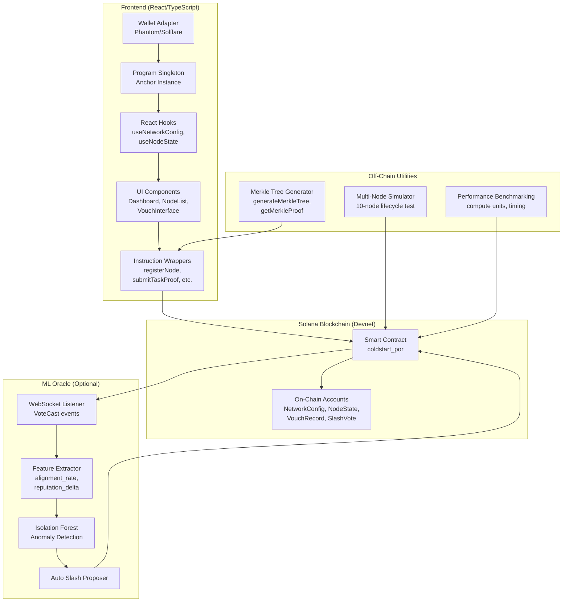

# Design Document: ColdStart-PoR Protocol Upgrade

## Overview

### Purpose

This design document specifies the technical architecture for upgrading the ColdStart-PoR blockchain protocol from a B-grade to an A-grade final-year engineering project. The upgrade transforms the protocol from a local test implementation into a production-ready system deployed on Solana devnet with full frontend integration and optional ML-based anomaly detection.

### Background

ColdStart-PoR is a Proof-of-Reputation blockchain protocol that solves the cold-start problem for new nodes joining a reputation-based consensus network. The protocol uses a three-phase bootstrapping mechanism:

- **Phase 1 (Probationary Tasks)**: Candidates complete N verifiable micro-tasks to prove computational capability
- **Phase 2 (Stake-Backed Vouching)**: Established nodes stake reputation to vouch for candidates
- **Phase 3 (Graduated Participation)**: Candidates participate in consensus (vote-only) for M rounds before full graduation

The current implementation uses SHA256 hashcash for Phase 1 tasks and single-authority slashing decisions. This upgrade addresses three critical security vulnerabilities:

1. **Hashcash tasks are arbitrary computation** - No connection to real-world verifiable data
2. **Self-reported voting outcomes** - Nodes can falsely claim honesty to inflate reputation
3. **Centralized slashing** - Single authority can abuse slashing power

### Scope

This design covers:

1. **Smart Contract Architecture Changes**
   - Merkle proof-based task verification (Requirement 1)
   - Committee-confirmed voting outcomes (Requirement 2)
   - Committee-based slashing with 3-of-5 threshold (Requirement 3)
   - New account structures and instructions

2. **Frontend Architecture**
   - Wallet adapter integration (Requirement 4)
   - Anchor program singleton and PDA helpers (Requirement 5)
   - React hooks for on-chain account fetching (Requirement 6)
   - Instruction execution wrappers (Requirement 7)
   - Merkle tree generation utilities (Requirement 8)
   - UI component blockchain integration (Requirements 9-10)

3. **Deployment Infrastructure**
   - Devnet deployment configuration (Requirement 11)
   - Devnet test execution (Requirement 12)
   - Performance benchmarking (Requirement 13)
   - Multi-node simulation (Requirement 14)
   - Web application deployment (Requirement 15)
   - Academic paper updates (Requirement 16)

4. **ML Oracle Architecture (Optional)**
   - Feature extraction from on-chain events (Requirement 17)
   - Isolation Forest anomaly detection (Requirement 18)
   - WebSocket event listener (Requirement 19)
   - Automatic slash proposal (Requirement 20)

5. **Backward Compatibility**
   - Test suite compatibility (Requirement 21)
   - Fixed-point arithmetic preservation (Requirement 22)

### Key Design Decisions

**Why Merkle proofs over hashcash?**
- Merkle proofs verify inclusion in a tree of real-world data (Solana block hashes)
- Provides verifiable connection to blockchain state rather than arbitrary computation
- Prevents gaming through pre-computation while maintaining low verification cost

**Why committee voting for outcomes?**
- Prevents self-reported honesty attacks where nodes falsely claim correct votes
- Requires 3 independent Full_Nodes to confirm voting outcomes before reputation updates
- Maintains decentralization while preventing reputation inflation

**Why 3-of-5 slashing threshold?**
- Balances security (prevents single malicious actor) with liveness (doesn't require unanimous agreement)
- Follows industry standards (e.g., Ethereum validator committees)
- Allows minority dissent without blocking legitimate slashing

**Why fixed-point BPS arithmetic?**
- Solana programs cannot use floating-point operations
- Basis points (1/10000) provide sufficient precision for reputation calculations
- All values in range [0, 10000] map to [0.0, 1.0] with 4 decimal places

**Why PDA-based account derivation?**
- Deterministic addressing enables frontend to compute account addresses without RPC queries
- Prevents address collision attacks
- Standard Solana pattern for program-owned accounts

**Why WebSocket over polling for events?**
- Real-time anomaly detection requires immediate notification of VoteCast events
- Reduces RPC load compared to polling
- Standard pattern for Solana event listeners

**Why Isolation Forest for anomaly detection?**
- Unsupervised learning - no labeled training data required
- Effective for high-dimensional feature spaces (alignment_rate, reputation_delta, join_recency, vote_frequency)
- Fast inference suitable for real-time detection
- Proven effectiveness in fraud detection domains

## Architecture

### System Architecture


The ColdStart-PoR protocol upgrade consists of four major subsystems:



### Component Interactions

1. **User → Frontend → Smart Contract**: User connects wallet, frontend calls instructions via Anchor
2. **Smart Contract → Events → ML Oracle**: VoteCast events trigger anomaly detection
3. **ML Oracle → Smart Contract**: Detected anomalies trigger propose_slash
4. **Off-Chain Utilities → Smart Contract**: Merkle tree generation enables task proof submission

## Data Models

### Smart Contract Accounts

#### NetworkConfig (Modified)
```rust
pub struct NetworkConfig {
    pub authority: Pubkey,           // 32 bytes
    pub delta_bps: u64,              // 8 bytes
    pub alpha_bps: u64,              // 8 bytes
    pub theta_p_bps: u64,            // 8 bytes
    pub tau_v_bps: u64,              // 8 bytes
    pub lambda_bps: u64,             // 8 bytes
    pub n_tasks: u8,                 // 1 byte
    pub m_rounds: u8,                // 1 byte
    pub current_round: u64,          // 8 bytes
    pub total_nodes: u32,            // 4 bytes
    pub task_merkle_root: [u8; 32],  // 32 bytes - NEW
    pub merkle_depth: u8,            // 1 byte - NEW
    pub bump: u8,                    // 1 byte
}
// PDA: ["config"]
// Size: 8 + 32 + 8*5 + 1*2 + 8 + 4 + 32 + 1*2 + padding = ~130 bytes
```

#### SlashVote (New)
```rust
pub struct SlashVote {
    pub candidate: Pubkey,           // 32 bytes
    pub votes: u8,                   // 1 byte
    pub voter_1: Option<Pubkey>,     // 33 bytes
    pub voter_2: Option<Pubkey>,     // 33 bytes
    pub voter_3: Option<Pubkey>,     // 33 bytes
    pub active: bool,                // 1 byte
    pub bump: u8,                    // 1 byte
}
// PDA: ["slash_vote", candidate]
// Size: 8 + 32 + 1 + 33*3 + 1*2 + padding = ~150 bytes
```

### Events

#### RoundOutcomeRecorded (New)
```rust
pub struct RoundOutcomeRecorded {
    pub node: Pubkey,
    pub round: u64,
    pub was_honest: bool,
    pub new_reputation_bps: u64,
}
```

#### SlashProposed (New)
```rust
pub struct SlashProposed {
    pub candidate: Pubkey,
    pub proposer: Pubkey,
    pub vote_count: u8,
}
```

#### SlashExecuted (New)
```rust
pub struct SlashExecuted {
    pub candidate: Pubkey,
    pub voucher: Pubkey,
    pub slashed_bps: u64,
    pub total_votes: u8,
}
```

## Smart Contract Design

### Modified Instructions

#### submit_task_proof (Modified)
```rust
pub fn submit_task_proof(
    ctx: Context<SubmitTaskProof>,
    task_index: u8,
    leaf_data: [u8; 32],      // NEW
    proof: Vec<[u8; 32]>,     // NEW
) -> Result<()>
```
**Changes**: Replace nonce parameter with leaf_data and proof. Add Merkle verification logic.

#### cast_vote (Modified)
```rust
pub fn cast_vote(
    ctx: Context<CastVote>,
    round: u64,
    // REMOVED: honest: bool
) -> Result<()>
```
**Changes**: Remove honest parameter. Only record vote, don't update reputation.

### New Instructions

#### record_round_outcome
```rust
#[derive(Accounts)]
pub struct RecordRoundOutcome<'info> {
    pub authority: Signer<'info>,
    pub cosigner_1: Signer<'info>,
    pub cosigner_1_state: Account<'info, NodeState>,
    pub cosigner_2: Signer<'info>,
    pub cosigner_2_state: Account<'info, NodeState>,
    #[account(mut)]
    pub config: Account<'info, NetworkConfig>,
    #[account(mut)]
    pub target_node: Account<'info, NodeState>,
}

pub fn record_round_outcome(
    ctx: Context<RecordRoundOutcome>,
    round: u64,
    was_honest: bool,
) -> Result<()>
```

#### propose_slash
```rust
#[derive(Accounts)]
pub struct ProposeSlash<'info> {
    #[account(mut)]
    pub proposer: Signer<'info>,
    pub proposer_state: Account<'info, NodeState>,
    pub candidate_state: Account<'info, NodeState>,
    #[account(init, payer = proposer, space = SlashVote::LEN)]
    pub slash_vote: Account<'info, SlashVote>,
    pub system_program: Program<'info, System>,
}

pub fn propose_slash(ctx: Context<ProposeSlash>) -> Result<()>
```

#### vote_slash
```rust
pub fn vote_slash(ctx: Context<VoteSlash>) -> Result<()>
```

#### execute_slash
```rust
pub fn execute_slash(ctx: Context<ExecuteSlash>) -> Result<()>
```

### Helper Functions

#### verify_merkle_proof
```rust
fn verify_merkle_proof(
    leaf_hash: [u8; 32],
    proof: &[[u8; 32]],
    leaf_index: u8,
    root: [u8; 32],
) -> bool {
    let mut current = leaf_hash;
    let mut index = leaf_index as usize;
    
    for sibling in proof.iter() {
        let mut combined = [0u8; 64];
        if index % 2 == 0 {
            combined[..32].copy_from_slice(&current);
            combined[32..].copy_from_slice(sibling);
        } else {
            combined[..32].copy_from_slice(sibling);
            combined[32..].copy_from_slice(&current);
        }
        current = Sha256::digest(&combined).into();
        index /= 2;
    }
    current == root
}
```

## Frontend Architecture

### Directory Structure
```
apps/web/src/
├── chain/
│   ├── wallet-provider.tsx    # Wallet adapter setup
│   ├── program.ts              # Anchor program singleton
│   ├── accounts.ts             # Account fetching hooks
│   ├── instructions.ts         # Instruction wrappers
│   ├── merkle.ts               # Merkle tree utilities
│   └── types.ts                # TypeScript types from IDL
├── components/
│   ├── Dashboard.tsx
│   ├── NodeList.tsx
│   └── VouchInterface.tsx
└── store/
    └── useStore.js             # Zustand state management
```

### Wallet Provider
```typescript
// chain/wallet-provider.tsx
export function SolanaWalletProvider({ children }) {
  const endpoint = useMemo(() => clusterApiUrl('devnet'), []);
  const wallets = useMemo(() => [
    new PhantomWalletAdapter(),
    new SolflareWalletAdapter(),
  ], []);
  
  return (
    <ConnectionProvider endpoint={endpoint}>
      <WalletProvider wallets={wallets} autoConnect>
        <WalletModalProvider>
          {children}
        </WalletModalProvider>
      </WalletProvider>
    </ConnectionProvider>
  );
}
```

### Program Singleton
```typescript
// chain/program.ts
export const PROGRAM_ID = new PublicKey('CFK9b4RXvcmJKfxodF5HNshWGfkvoQ2iAaN9eyRJnGfh');

export function getProgram(provider: AnchorProvider): Program {
  return new Program(IDL as Idl, PROGRAM_ID, provider);
}

export function configPda(): [PublicKey, number] {
  return PublicKey.findProgramAddressSync([Buffer.from('config')], PROGRAM_ID);
}

export function nodePda(owner: PublicKey): [PublicKey, number] {
  return PublicKey.findProgramAddressSync([Buffer.from('node'), owner.toBuffer()], PROGRAM_ID);
}

export function slashVotePda(candidate: PublicKey): [PublicKey, number] {
  return PublicKey.findProgramAddressSync([Buffer.from('slash_vote'), candidate.toBuffer()], PROGRAM_ID);
}
```

### Account Hooks
```typescript
// chain/accounts.ts
export function useNodeState(owner?: PublicKey) {
  const { connection } = useConnection();
  const [nodeState, setNodeState] = useState(null);
  
  useEffect(() => {
    if (!owner) return;
    const provider = new AnchorProvider(connection, wallet, {});
    const program = getProgram(provider);
    const [pda] = nodePda(owner);
    
    program.account.nodeState.fetch(pda)
      .then(setNodeState)
      .catch(() => setNodeState(null));
  }, [owner, connection]);
  
  return nodeState;
}
```

### Instruction Wrappers
```typescript
// chain/instructions.ts
export async function registerNode(provider: AnchorProvider): Promise<string> {
  const program = getProgram(provider);
  const [config] = configPda();
  const [nodeState] = nodePda(provider.wallet.publicKey);
  
  return await program.methods
    .registerNode()
    .accounts({ owner: provider.wallet.publicKey, config, nodeState, systemProgram: SystemProgram.programId })
    .rpc();
}

export async function submitTaskProof(
  provider: AnchorProvider,
  taskIndex: number,
  leafData: Uint8Array,
  proof: Uint8Array[]
): Promise<string> {
  const program = getProgram(provider);
  const [config] = configPda();
  const [nodeState] = nodePda(provider.wallet.publicKey);
  
  return await program.methods
    .submitTaskProof(taskIndex, Array.from(leafData), proof.map(p => Array.from(p)))
    .accounts({ owner: provider.wallet.publicKey, config, nodeState })
    .rpc();
}
```

### Merkle Tree Utilities
```typescript
// chain/merkle.ts
export function buildMerkleTree(leaves: Buffer[]): { root: Buffer; depth: number } {
  let layer = [...leaves];
  while (layer.length & (layer.length - 1)) {
    layer.push(layer[layer.length - 1]);
  }
  
  const depth = Math.log2(layer.length);
  while (layer.length > 1) {
    const next: Buffer[] = [];
    for (let i = 0; i < layer.length; i += 2) {
      next.push(sha256(Buffer.concat([layer[i], layer[i + 1]])));
    }
    layer = next;
  }
  
  return { root: layer[0], depth };
}

export function getMerkleProof(leaves: Buffer[], index: number): Buffer[] {
  // Standard Merkle proof construction
  const proof: Buffer[] = [];
  let layer = [...leaves];
  let idx = index;
  
  while (layer.length > 1) {
    const sibling = idx % 2 === 0 ? layer[idx + 1] : layer[idx - 1];
    proof.push(sibling);
    
    const next: Buffer[] = [];
    for (let i = 0; i < layer.length; i += 2) {
      next.push(sha256(Buffer.concat([layer[i], layer[i + 1]])));
    }
    layer = next;
    idx = Math.floor(idx / 2);
  }
  
  return proof;
}
```

## Off-Chain Utilities

### Merkle Tree Generation Script
```typescript
// scripts/generate-task-dataset.ts
import { Connection, clusterApiUrl } from '@solana/web3.js';
import { buildMerkleTree } from '../apps/web/src/chain/merkle';
import fs from 'fs';

async function generateTaskDataset() {
  const connection = new Connection(clusterApiUrl('mainnet-beta'));
  const slot = await connection.getSlot();
  
  const tasks: Buffer[] = [];
  for (let i = 0; i < 20; i++) {
    const block = await connection.getBlock(slot - i);
    tasks.push(Buffer.from(block.blockhash));
  }
  
  const tree = buildMerkleTree(tasks);
  fs.writeFileSync('target/task-dataset.json', JSON.stringify({
    root: tree.root.toString('hex'),
    depth: tree.depth,
    leaves: tasks.map(t => t.toString('hex'))
  }));
}
```

### Multi-Node Simulation
```typescript
// scripts/simulate-network.ts
async function simulateNetwork() {
  const nodes = Array.from({ length: 10 }, () => Keypair.generate());
  
  // Phase 1: Register and complete tasks
  for (const node of nodes) {
    await registerNode(node);
    for (let i = 0; i < 20; i++) {
      await submitTaskProof(node, i, leafData, proof);
    }
  }
  
  // Phase 2: Vouch for all nodes
  for (const node of nodes) {
    await vouchForNode(genesisNode, node.publicKey);
  }
  
  // Phase 3: Vote for M rounds
  for (let round = 0; round < 10; round++) {
    for (const node of nodes) {
      await castVote(node, round);
    }
    await recordRoundOutcome(authority, node.publicKey, round, true);
  }
}
```

## ML Oracle Design

### Architecture
```
┌─────────────────────────────────────┐
│  WebSocket Listener                 │
│  - Subscribe to VoteCast events     │
│  - Parse event data                 │
└──────────────┬──────────────────────┘
               │
               ▼
┌─────────────────────────────────────┐
│  Feature Extractor                  │
│  - alignment_rate                   │
│  - reputation_delta                 │
│  - join_recency                     │
│  - vote_frequency                   │
└──────────────┬──────────────────────┘
               │
               ▼
┌─────────────────────────────────────┐
│  Isolation Forest Model             │
│  - Train on historical data         │
│  - Predict anomaly score            │
│  - Threshold: -0.5                  │
└──────────────┬──────────────────────┘
               │
               ▼
┌─────────────────────────────────────┐
│  Auto Slash Proposer                │
│  - Call propose_slash               │
│  - Cooldown: 50 rounds              │
└─────────────────────────────────────┘
```

### Feature Extraction
```python
# scripts/ml-oracle/detector.py
class VotingAnomalyDetector:
    def extract_features(self, node: str) -> np.ndarray:
        history = self.vote_history.get(node, [])
        if len(history) < 5:
            return None
        
        alignment_rate = np.mean([h['aligned'] for h in history[-10:]])
        rep_values = [h['reputation'] for h in history[-10:]]
        reputation_delta = rep_values[-1] - rep_values[0]
        join_recency = len(history)
        vote_frequency = len(history) / max(1, history[-1]['round'] - history[0]['round'])
        
        return np.array([alignment_rate, reputation_delta, join_recency, vote_frequency])
```

### WebSocket Listener
```python
# scripts/ml-oracle/chain_listener.py
async def listen_to_votes(callback):
    async with connect("wss://api.devnet.solana.com") as ws:
        await ws.logs_subscribe(
            {"mentions": [PROGRAM_ID]},
            commitment="confirmed"
        )
        async for msg in ws:
            for log in msg.result.value.logs:
                if "VoteCast" in log:
                    await callback(parse_vote_event(log))
```

## Deployment Architecture

### Devnet Configuration
```toml
# Anchor.toml
[programs.devnet]
coldstart_por = "CFK9b4RXvcmJKfxodF5HNshWGfkvoQ2iAaN9eyRJnGfh"

[provider]
cluster = "Devnet"
wallet = "~/.config/solana/id.json"
```

### Frontend Environment
```bash
# apps/web/.env
VITE_SOLANA_CLUSTER=devnet
VITE_PROGRAM_ID=CFK9b4RXvcmJKfxodF5HNshWGfkvoQ2iAaN9eyRJnGfh
```

### Vercel Deployment
```json
// vercel.json
{
  "buildCommand": "cd apps/web && npm run build",
  "outputDirectory": "apps/web/dist",
  "env": {
    "VITE_SOLANA_CLUSTER": "devnet"
  }
}
```

## Implementation Guidance

### Phase 1: Smart Contract Fixes (20h)

**Order**:
1. Add Merkle fields to NetworkConfig (1h)
2. Implement verify_merkle_proof helper (2h)
3. Modify submit_task_proof instruction (3h)
4. Add SlashVote account (2h)
5. Implement propose_slash, vote_slash, execute_slash (4h)
6. Modify cast_vote (remove honest param) (1h)
7. Add record_round_outcome instruction (4h)
8. Update tests (3h)

**Testing Strategy**:
- Unit tests for verify_merkle_proof
- Integration tests for committee voting
- Integration tests for 3-of-5 slashing
- Edge cases: invalid proofs, double voting, insufficient votes

### Phase 2: Frontend Integration (20h)

**Order**:
1. Install dependencies (0.5h)
2. Create wallet-provider.tsx (1h)
3. Create program.ts with PDA helpers (2h)
4. Create accounts.ts hooks (3h)
5. Create instructions.ts wrappers (4h)
6. Create merkle.ts utilities (3h)
7. Wire UI components (5h)
8. Fix vouch component (1.5h)

**Testing Strategy**:
- Manual testing with Phantom wallet
- Verify all instructions execute on devnet
- Check Explorer links work
- Verify account state updates in UI

### Phase 3: Deployment & Benchmarking (8h)

**Order**:
1. Update Anchor.toml (0.5h)
2. Deploy to devnet (1h)
3. Run tests on devnet (1h)
4. Create benchmarking script (2h)
5. Create simulation script (2h)
6. Deploy to Vercel (1h)
7. Update paper (0.5h)

### Phase 4: ML Oracle (15h, Optional)

**Order**:
1. Setup Python environment (1h)
2. Implement WebSocket listener (3h)
3. Implement feature extractor (4h)
4. Integrate Isolation Forest (3h)
5. Implement auto slash proposer (2h)
6. Test with simulated bad node (2h)

## API Specifications

### PDA Derivations
- `config`: `["config"]`
- `node`: `["node", owner_pubkey]`
- `vouch`: `["vouch", voucher_pubkey, candidate_pubkey]`
- `slash_vote`: `["slash_vote", candidate_pubkey]`

### Instruction Signatures
```rust
initialize_network(delta_bps, alpha_bps, theta_p_bps, tau_v_bps, lambda_bps, n_tasks, m_rounds, task_merkle_root, merkle_depth)
bootstrap_genesis_node(initial_reputation_bps)
register_node()
submit_task_proof(task_index, leaf_data, proof)
vouch_for_node()
cast_vote(round)
record_round_outcome(round, was_honest)
release_voucher_stake()
propose_slash()
vote_slash()
execute_slash()
advance_round()
```

### Event Schemas
All events include discriminator (8 bytes) + fields. Events are emitted via `emit!()` macro and logged to transaction logs.

## Correctness Properties

1. **Merkle Soundness**: `∀ valid trees, verify_merkle_proof accepts valid proofs ∧ rejects invalid proofs`
2. **No Self-Reported Reputation**: `∀ reputation updates, ∃ committee confirmation`
3. **Decentralized Slashing**: `∀ slashing executions, votes ≥ 3`
4. **Bounded Reputation**: `∀ nodes, 0 ≤ reputation_bps ≤ 10000`
5. **PDA Correctness**: `∀ accounts, address = derive_pda(seeds, program_id)`
6. **Round-Trip Verification**: `∀ Merkle trees, verify(root, leaf, get_proof(tree, leaf)) = true`
